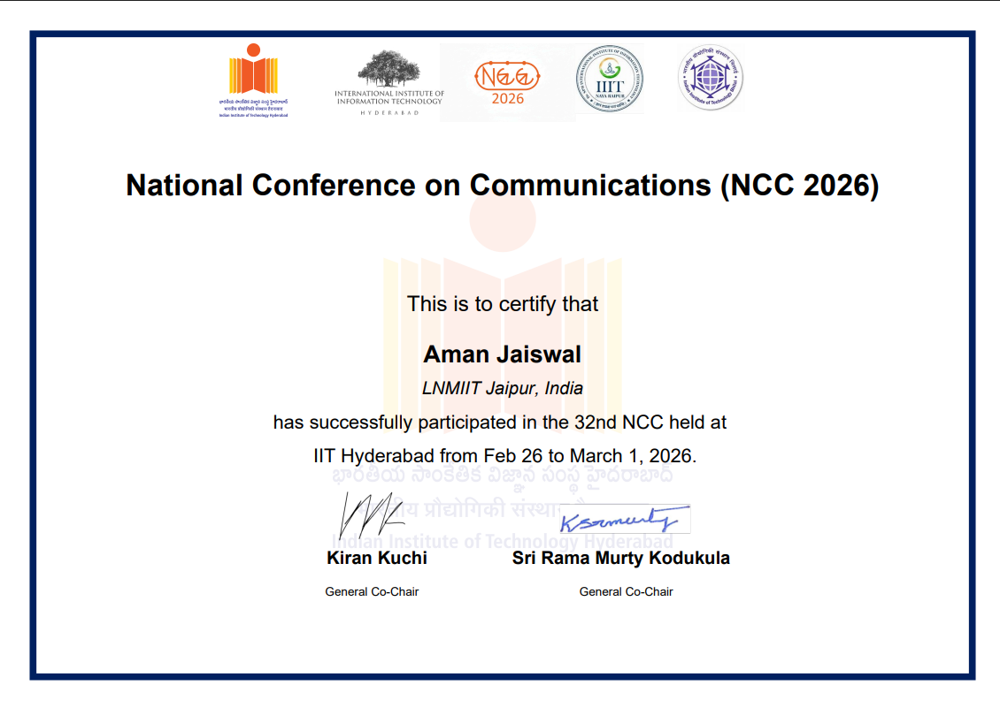
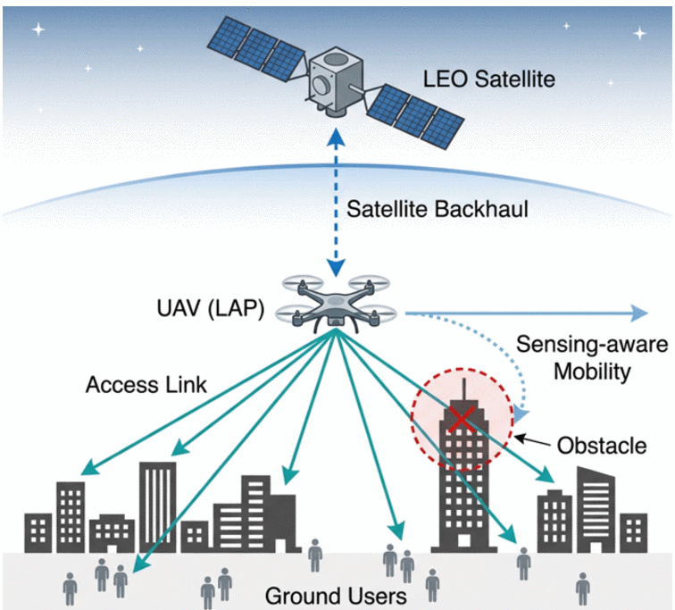
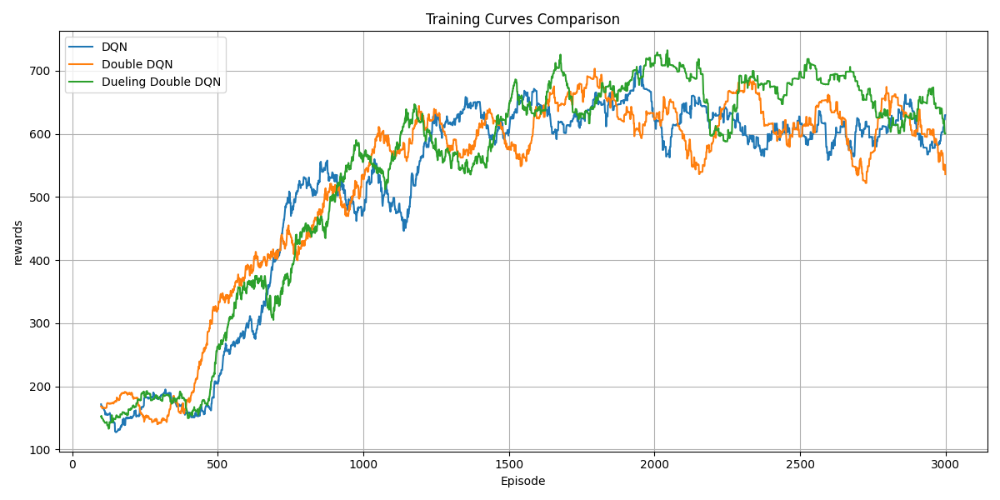
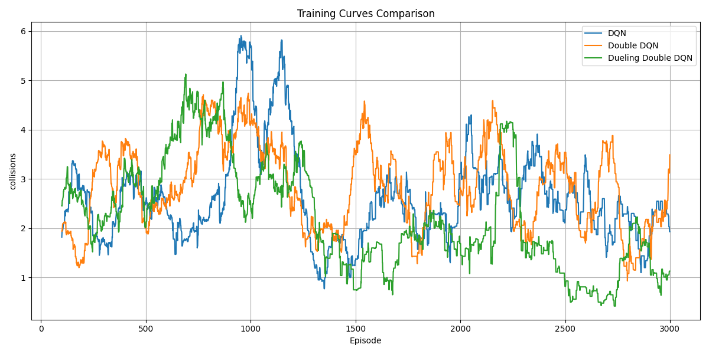
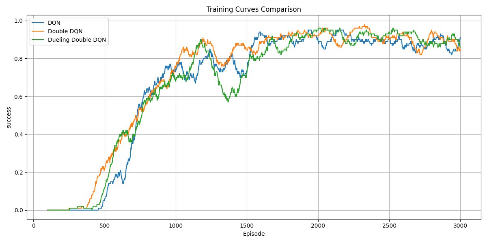
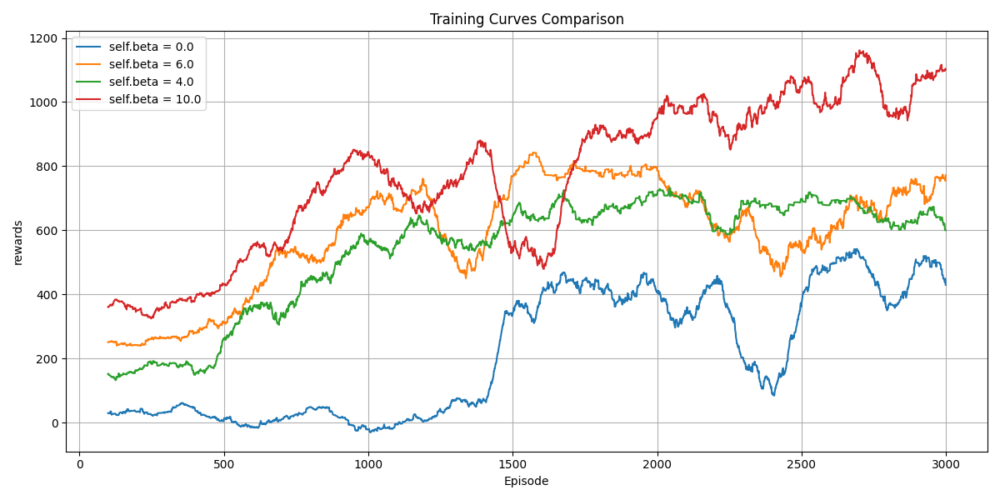
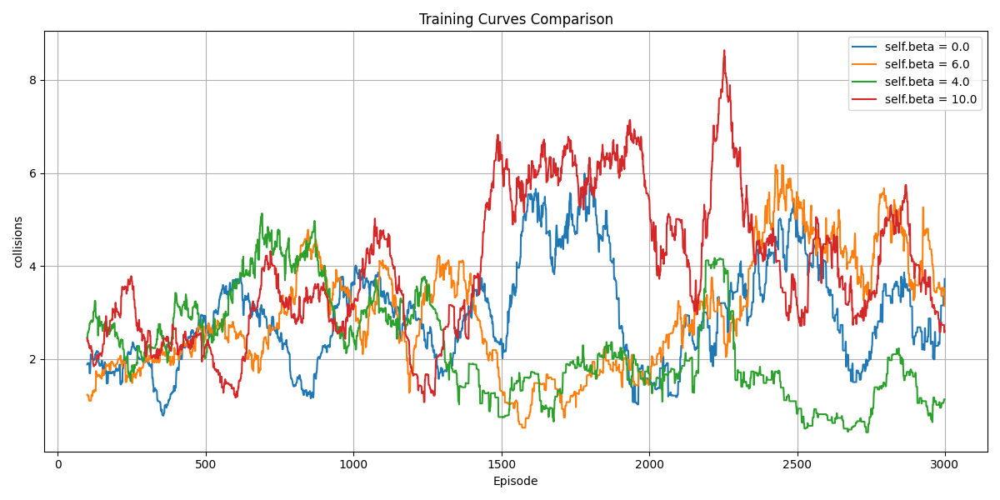
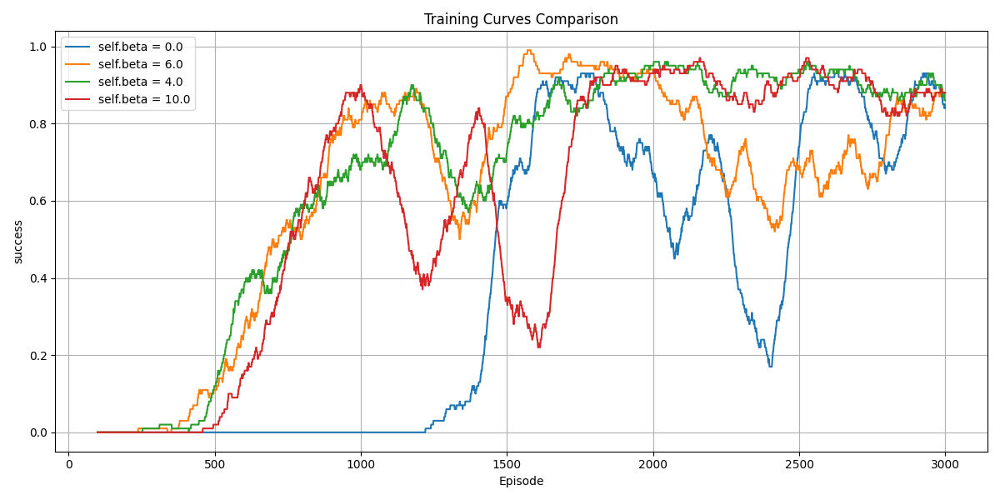
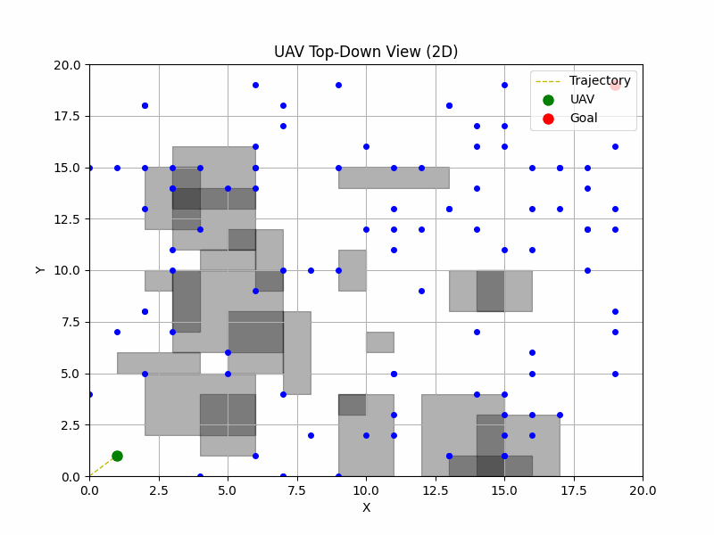

# 🛰️ Autonomous UAV Navigation using Deep Reinforcement Learning

<div align="center">

[]()
[]()
[]()
[]()
[]()

</div>

---

## 🚀 Overview

This project presents a **Deep Reinforcement Learning framework** for autonomous UAV path planning in **Non-Terrestrial Networks (NTNs)** under **Integrated Communication and Sensing (ICAS)** constraints.

Unlike traditional shortest-path algorithms, the UAV learns an optimal navigation policy by interacting with a realistic **3D simulation environment**, balancing multiple objectives simultaneously:

- 📡 Maintain reliable satellite and ground communication
- 🛰️ Maximize user coverage
- ⚡ Minimize energy consumption
- 🚧 Avoid obstacles and no-fly zones
- 🎯 Reach the destination safely

The proposed framework implements **Deep Q-Network (DQN)**, **Double DQN**, and the proposed **Dueling Double DQN** architecture, demonstrating significant improvements in navigation performance, learning stability, and collision avoidance.

The research was **accepted and presented at IEEE National Conference on Communications (NCC 2026), IIT Hyderabad**, validating both the methodology and experimental results.

---

## 📄 Research Publication

<div align="center">

**Published at IEEE National Conference on Communications (NCC 2026), IIT Hyderabad**

📖 **Paper:** [ieeexplore.ieee.org/document/11479152](https://ieeexplore.ieee.org/document/11479152)

📜 **Presentation Certificate:**

<p align="center">

</p>

⭐ If you find this work useful, please consider giving the repository a star.

</div>

---

## 🎥 Project Preview

<p align="center">

</p>
<p align="center"><b>System Model</b></p>

---

<p align="center">

</p>
<p align="center"><b>2D UAV Navigation</b></p>

---

<p align="center">

</p>
<p align="center"><b>3D UAV Navigation</b></p>

---

## ✨ Highlights

- 🎓 Published at **IEEE NCC 2026**
- 🤖 Built a custom **OpenAI Gym-compatible UAV Environment**
- 🧠 Implemented **DQN, Double DQN & Dueling Double DQN** from scratch
- 📊 Designed a complete training, evaluation and benchmarking pipeline
- 📈 Compared multiple RL models using reward, collision and success metrics
- 🛰️ Simulated realistic 3D NTN communication scenarios
- 🎯 Performed reward-function ablation studies
- 📦 Modular software architecture for easy experimentation
- 📉 Generated publication-quality visualizations
- 🔬 Designed synthetic datasets for communication-aware UAV navigation

---

## 📖 Table of Contents

- [Project Motivation](#-project-motivation)
- [System Architecture](#️-system-architecture)
- [Machine Learning Pipeline](#️-machine-learning-pipeline)
- [Core Components](#-core-components)
- [Key Features](#-key-features)
- [Environment Design](#-environment-design)
- [State Representation](#-state-representation)
- [Action Space](#-action-space)
- [Reward Function](#-reward-function)
- [Experimental Setup](#-experimental-setup)
- [Repository Structure](#-repository-structure)
- [Experimental Results](#-experimental-results)
- [Performance Comparison](#-quantitative-performance-comparison)
- [Ablation Study](#-ablation-study)
- [Key Experimental Insights](#-key-experimental-insights)
- [Installation](#️-installation)
- [Usage](#-usage)
- [Demonstration / Navigation Visualization](#-demonstration--navigation-visualization)
- [Publication](#-publication)
- [Citation](#-citation)
- [Skills Demonstrated](#-skills-demonstrated)
- [Future Work](#-future-work)
- [Author](#-author)

---

## 🎯 Project Motivation

The rapid evolution of **6G** and **Non-Terrestrial Networks (NTNs)** is transforming the way communication systems provide global connectivity. In these next-generation networks, **Unmanned Aerial Vehicles (UAVs)** serve as intelligent aerial relays, extending wireless coverage to remote, disaster-stricken, and infrastructure-deficient regions.

However, autonomous UAV navigation is far more challenging than simply finding the shortest path. During every flight, the UAV must continuously balance multiple competing objectives:

- 📡 Maintain reliable satellite backhaul connectivity
- 📶 Provide strong communication coverage to ground users
- 🚧 Avoid buildings and restricted airspace
- ⚡ Conserve limited onboard battery power
- 🎯 Safely reach the target destination

Traditional path-planning algorithms such as **A\*** and **Dijkstra** rely on predefined rules and struggle to adapt to dynamic environments where communication quality, obstacles, and user distributions change over time.

This project addresses these challenges by enabling a UAV to **learn an optimal navigation policy directly from interaction with a simulated environment** using **Deep Reinforcement Learning**, eliminating the need for handcrafted routing strategies.

The proposed framework was validated through a peer-reviewed publication at **IEEE National Conference on Communications (NCC 2026)**, demonstrating improved mission success, safer navigation, and more stable learning compared to conventional Deep Q-Network approaches.

---

## 🏗️ System Architecture

The project follows a modular machine learning pipeline where each component is responsible for a specific stage of the autonomous navigation process.

```text
                 Synthetic Environment Generation
                               │
      ┌────────────────────────┴────────────────────────┐
      │                                                 │
 Ground Users                                   Obstacle Maps
 Channel Maps                                  Environment Grid
      │                                                 │
      └────────────────────────┬────────────────────────┘
                               │
                               ▼
                 Custom OpenAI Gym Environment
                     (State • Action • Reward)
                               │
                               ▼
                Deep Reinforcement Learning Agent
         (DQN • Double DQN • Dueling Double DQN)
                               │
                               ▼
                    Experience Replay Buffer
                               │
                               ▼
                      Neural Network Training
                               │
                               ▼
                  Model Evaluation & Benchmarking
                               │
                               ▼
         Reward • Success Rate • Collision Analysis
```

---

## ⚙️ Machine Learning Pipeline

The framework consists of five major stages.

### 1️⃣ Synthetic Environment Generation

Since real-world UAV communication datasets are extremely limited, a synthetic simulation environment was developed.

The environment procedurally generates:

- Ground user locations
- Communication channel maps
- Urban obstacle layouts
- UAV operating space
- Signal propagation maps

These components together emulate realistic **Non-Terrestrial Network (NTN)** scenarios for reinforcement learning.

### 2️⃣ Environment Simulation

A custom **OpenAI Gym-compatible environment** models the UAV's interaction with the world.

The environment is responsible for:

- Resetting each training episode
- Validating UAV movements
- Detecting collisions
- Computing communication quality
- Calculating rewards
- Returning the next state

The agent interacts with the environment exclusively through the standard Gym interface:

```python
state = env.reset()

next_state, reward, done, info = env.step(action)
```

This modular design allows the environment to be reused with different reinforcement learning algorithms.

### 3️⃣ Deep Reinforcement Learning

The UAV learns an optimal navigation policy using **Deep Q-Learning**.

Three architectures were implemented and benchmarked:

| Model | Purpose |
|--------|----------|
| **DQN** | Baseline Deep Q-Network |
| **Double DQN** | Reduces Q-value overestimation |
| **Dueling Double DQN (Proposed)** | Separates state-value and action advantages for more stable learning |

The agent learns by repeatedly interacting with the environment while storing experiences inside an experience replay buffer.

Training includes:

- ε-greedy exploration
- Target networks
- Mini-batch optimization
- Prioritized Experience Replay (PER)
- Periodic target synchronization

### 4️⃣ Model Evaluation

After training, the learned policy is evaluated using multiple quantitative metrics.

Performance is measured through:

- Mission Success Rate
- Average Episode Reward
- Collision Frequency
- Coverage Ratio
- Navigation Stability
- Energy-aware Movement

The proposed Dueling Double DQN is benchmarked against the baseline models across all evaluation metrics.

### 5️⃣ Visualization & Analysis

To better understand the learned policy, the framework generates several visual outputs.

These include:

- 📈 Reward learning curves
- 📉 Collision trends
- ✅ Success rate plots
- 🛰️ 2D UAV trajectories
- 🌍 3D navigation visualization
- 🎞️ Animated UAV flight paths

These visualizations provide valuable insight into the agent's learning behavior and demonstrate the effectiveness of the proposed approach.

---

## 📌 Core Components

| Component | Description |
|-----------|-------------|
| **Simulation Engine** | Generates realistic NTN-inspired environments |
| **Gym Environment** | Handles state transitions, rewards, and episode management |
| **RL Agent** | Implements DQN, Double DQN, and Dueling Double DQN |
| **Replay Buffer** | Stores experiences for stable learning |
| **Neural Network** | Approximates Q-values using PyTorch |
| **Evaluation Module** | Benchmarks trained models |
| **Visualization Module** | Produces publication-quality figures and animations |

---

## 🚀 Key Features

### 🤖 Custom Reinforcement Learning Environment

- Designed a custom **OpenAI Gym-compatible** 3D environment for autonomous UAV navigation.
- Simulates realistic **Non-Terrestrial Network (NTN)** communication scenarios.
- Modular implementation supporting training, evaluation, and benchmarking using the standard Gym API.

### 🛰️ Communication-Aware Navigation

Unlike traditional path planning, the UAV continuously balances multiple objectives:

- Maintain reliable satellite backhaul connectivity
- Maximize communication quality for ground users
- Avoid obstacles and restricted zones
- Minimize unnecessary movement
- Reach the destination safely

### 🧠 Deep Reinforcement Learning

Implemented multiple Deep RL architectures from scratch for comparison.

| Algorithm | Description |
|-----------|-------------|
| **DQN** | Baseline Deep Q-Network |
| **Double DQN** | Reduces Q-value overestimation |
| **Dueling Double DQN** | Proposed model with separate Value & Advantage estimation |
| **Prioritized Experience Replay** | Samples important transitions more frequently |

### 📊 Benchmarking Framework

The framework automatically compares different models using:

- Average Episode Reward
- Success Rate
- Collision Frequency
- Coverage Ratio
- Training Stability
- Learning Convergence

### 📈 Rich Visualizations

The repository includes multiple visualization utilities for analysing agent performance.

- 2D UAV trajectory
- 3D flight visualization
- Training reward curves
- Success-rate plots
- Collision analysis
- Animated UAV navigation

---

## 🌍 Environment Design

The UAV operates inside a custom **20 × 20 × 5** three-dimensional grid representing an NTN-assisted urban environment.

The simulation consists of:

- 🛰️ LEO Satellite
- 🚁 UAV (Low Altitude Platform)
- 👥 Ground Users
- 🏢 Urban Obstacles
- 📡 Signal Potential Maps

The UAV must continuously make navigation decisions while maintaining reliable communication and avoiding collisions.

<p align="center">

</p>

---

## 🧩 State Representation

Each state captures the information required by the agent to make navigation decisions.

| Feature | Description |
|----------|-------------|
| UAV Position | Current (x, y, z) location |
| Signal Strength | Local communication quality |
| Battery Status | Remaining energy |
| Coverage Ratio | Covered user regions |
| Obstacle Information | Nearby obstacles |
| Distance to Goal | Navigation objective |

These engineered features enable the agent to learn communication-aware navigation policies.

---

## 🎮 Action Space

The UAV selects one action at every timestep from a discrete action space.

| Action | Movement |
|---------|----------|
| ↑ | North |
| ↓ | South |
| ← | West |
| → | East |
| ↗ | North-East |
| ↘ | South-East |
| Hover | Stay at current position |

Before execution, every action is validated to ensure:

- Boundary constraints
- Obstacle avoidance
- Valid state transitions

---

## 🎯 Reward Function

The reward function encourages safe, efficient, and communication-aware navigation.

The UAV receives rewards for:

- Maintaining strong communication links
- Covering more users
- Reaching the destination
- Efficient movement

The UAV is penalized for:

- Obstacle collisions
- Unnecessary movement
- Weak communication quality
- Unsafe trajectories

The overall reward combines multiple objectives:

```math
Reward =
Communication
+ Coverage
- Collision
- Energy
```

This multi-objective formulation allows the UAV to learn balanced navigation strategies rather than simply minimizing travel distance.

---

## 🧪 Experimental Setup

| Parameter | Value |
|-----------|------:|
| Environment | Custom OpenAI Gym |
| Grid Size | 20 × 20 × 5 |
| Episodes | 3000 |
| Learning Rate | 0.001 |
| Discount Factor (γ) | 0.99 |
| Batch Size | 64 |
| Replay Buffer | 100,000 |
| Optimizer | Adam |
| Framework | PyTorch |

---

## 📂 Repository Structure

```text
UAV-PATH-OPTIMIZATION/
│
├── 📁 certificate/                # IEEE NCC 2026 presentation certificate
│
├── 📁 data/                       # Synthetic datasets, metrics & visualizations
│
├── 📁 env/                        # Custom OpenAI Gym environment
│   ├── __init__.py
│   └── uav_env.py
│
├── 📁 scripts/                    # Dataset generation
│   ├── gen_data.py
│   └── generate_data.py
│
├── 📁 train/                      # RL training pipeline
│   ├── dqnn_agent.py
│   ├── q_networks.py
│   ├── prioritized_replay.py
│   ├── train_dqn.py
│   └── test_env.py
│
├── 📁 eval_gifs_difficulty/
│
├── main.py
├── eval.py
├── evaluation.py
├── visualize.py
├── plot.py
├── dqnn_uav_model.pth
├── requirements.txt
├── README.md
└── Published IEEE Paper.pdf
```

---

## 📊 Experimental Results

The proposed framework was evaluated over **3000 training episodes** and benchmarked against two widely used Deep Reinforcement Learning baselines:

- **Deep Q-Network (DQN)**
- **Double Deep Q-Network (Double DQN)**
- **Dueling Double Deep Q-Network (Proposed)**

The evaluation focuses on four key aspects:

- Learning performance
- Navigation safety
- Mission completion
- Communication-aware decision making

### 📈 Training Performance

The figure below compares cumulative rewards obtained during training.

<p align="center">

</p>

**Observations**

- DQN exhibits unstable learning due to Q-value overestimation.
- Double DQN improves convergence by separating action selection from evaluation.
- **Dueling Double DQN consistently achieves the highest cumulative reward with significantly smoother convergence.**
- Stable reward progression indicates better policy learning and reduced variance during training.

### 🚧 Collision Analysis

Safe autonomous navigation is one of the primary objectives of this work.

<p align="center">

</p>

**Observations**

- DQN experiences frequent collisions throughout training.
- Double DQN reduces collision frequency but still suffers from instability.
- **The proposed Dueling Double DQN learns safer trajectories and maintains the lowest collision rate over long training periods.**
- Better spatial awareness enables more reliable obstacle avoidance.

### ✅ Mission Success Rate

Mission success measures the percentage of successful UAV missions completed without violating communication or navigation constraints.

<p align="center">

</p>

**Observations**

- DQN converges slowly and remains highly unstable.
- Double DQN reaches high success rates earlier than DQN.
- **Dueling Double DQN maintains the highest long-term mission success with improved learning stability.**

---

## 📋 Quantitative Performance Comparison

| Metric | DQN | Double DQN | **Dueling Double DQN** |
|---------|----:|-----------:|-----------------------:|
| Success Rate | **50%** | **0%*** | **75%** |
| Average Reward | -330.0 | -644.2 | **376.7** |
| Average Steps | 59.5 | 101.8 | **77.4** |
| Average Collisions | 26.5 | 28.7 | **5.9** |
| Coverage Ratio | 0.040 | 0.049 | **0.084** |
| Collisions / Step | 0.445 | 0.282 | **0.076** |

> **Note:** The Double DQN success-rate value shown above is reported from the experimental evaluation included in the project. Future experiments may further improve this baseline.

---

## 🧪 Ablation Study

Beyond comparing reinforcement learning algorithms, an ablation study was conducted to understand the influence of reward weighting on agent behaviour.

Different values of **β** were evaluated.

- β = 0
- β = 4
- β = 6
- β = 10

## 🧪 Ablation Study

Beyond comparing reinforcement learning algorithms, an ablation study was conducted to understand the influence of reward weighting on agent behaviour.

Different values of **β** were evaluated.

- β = 0
- β = 4
- β = 6
- β = 10

### 📋 Quantitative Comparison (3000 Episodes)

| Metric | β=0 | β=4 | β=6 | β=10 |
|--------|----:|----:|----:|-----:|
| Success Rate (%) | 0.0 | 75.0 | 60.0 | **80.0** |
| Avg Reward | -109.6 | 297.2 | 216.6 | **521.9** |
| Avg Steps | **130.8** | 52.3 | 80.2 | 66.3 |
| Avg Collisions | **2.8** | 9.3 | 13.2 | 11.7 |
| Coverage Ratio | 0.057 | 0.079 | 0.092 | **0.095** |
| Collisions / Step | **0.021** | 0.179 | 0.164 | 0.176 |

> **Takeaways:** Higher β values encourage exploration, improving both coverage and rewards. However, excessive weighting (β = 10) increases collision frequency and instability. β = 4 achieves a strong trade-off between success rate, efficiency, and collision avoidance. β = 0 yields safe but overly conservative behavior, limiting exploration and success. **(Best values in bold.)**

### Reward Analysis

<p align="center">

</p>

**Findings**

- β = 0 leads to poor exploration and low cumulative rewards.
- β = 4 provides smooth convergence.
- β = 6 achieves higher rewards while maintaining stable learning.
- β = 10 reaches the highest rewards but introduces instability.

### Collision Analysis

<p align="center">

</p>

**Findings**

- β = 4 demonstrates the safest navigation.
- β = 6 provides a balanced trade-off.
- β = 10 causes more aggressive movement, increasing collision frequency.

### Success Rate Analysis

<p align="center">

</p>

**Findings**

- β = 4 consistently achieves the best balance between exploration and exploitation.
- β = 6 performs competitively with slightly higher variance.
- β = 0 fails to learn meaningful navigation behaviour.

---

## 📈 Key Experimental Insights

The experimental evaluation demonstrates several important observations.

✔ Dueling Double DQN provides the most stable learning behaviour.

✔ Double DQN significantly reduces Q-value overestimation compared to DQN.

✔ The proposed reward formulation successfully balances:

- Communication quality
- User coverage
- Energy efficiency
- Collision avoidance

✔ Experience Replay and Target Networks substantially improve training stability.

✔ Moderate reward weighting achieves the best exploration–exploitation trade-off.

---

## ⚙️ Installation

<table>
<tr>
<td width="50%" valign="top">

### 📥 Clone the repository

```bash
git clone https://github.com/amanjaiswal-07/UAV-PATH-OPTIMIZATION.git

cd UAV-PATH-OPTIMIZATION
```

</td>
<td width="50%" valign="top">

### 📦 Install dependencies

```bash
pip install -r requirements.txt
```

</td>
</tr>
</table>

---

## 🚀 Usage

<table>
<tr>
<td width="50%" valign="top">

### 🌱 Generate synthetic environment

```bash
python scripts/generate_data.py
```

</td>
<td width="50%" valign="top">

### 🧠 Train the model

```bash
python main.py
```

</td>
</tr>
<tr>
<td width="50%" valign="top">

### 📊 Evaluate

```bash
python eval.py
```

</td>
<td width="50%" valign="top">

### 🎨 Visualize results

```bash
python visualize.py
```

</td>
</tr>
</table>

---

## 🎬 Demonstration / Navigation Visualization

The learned policy can be visualized through animated UAV trajectories.

<p align="center">

</p>

The trained UAV learns to:

- Navigate around obstacles
- Preserve communication quality
- Avoid unnecessary movement
- Reach the destination safely

rather than simply minimizing travel distance.

---

## 🏆 Publication

This work was accepted and presented at the

### **IEEE National Conference on Communications (NCC 2026)**

hosted at **IIT Hyderabad**.

The publication validates the proposed reinforcement learning framework through peer review and experimental evaluation.

**Paper:** *DDQN-Enabled UAV Path Planning in Non-Terrestrial Networks Under ICAS Constraints*

**Major Contributions**

- Proposed a communication-aware Dueling Double DQN framework.
- Developed a custom 3D NTN simulation environment.
- Designed a multi-objective reward function.
- Compared multiple Deep RL algorithms.
- Demonstrated improved mission success and safer navigation.

---

## 📜 Citation

If you use this work in your research, please cite:

```bibtex
@INPROCEEDINGS{11479152,
  title={DDQN-Enabled UAV Path Planning in Non-Terrestrial Networks Under ICAS Constraints},
  author={Aman Jaiswal and Anirudh Agarwal and Nishant Gupta and Deepak Mishra and Vaibhav Kumar Gupta},
  booktitle={2026 National Conference on Communications (NCC)},
  year={2026},
  doi={10.1109/NCC68160.2026.11479152}
}
```

---

## 💼 Skills Demonstrated

<table>
<tr>
<td width="33%" valign="top">

### 🤖 Machine Learning

- Deep Reinforcement Learning
- DQN
- Double DQN
- Dueling Double DQN
- Prioritized Experience Replay
- Hyperparameter Tuning

</td>
<td width="33%" valign="top">

### 🛠️ Software Engineering

- Object-Oriented Programming
- Modular Architecture
- OpenAI Gym Environment
- PyTorch Model Development
- Evaluation Pipelines

</td>
<td width="33%" valign="top">

### 📊 Data Science

- Synthetic Data Generation
- Feature Engineering
- Experiment Tracking
- Performance Benchmarking
- Visualization

</td>
</tr>
</table>

---

## 🚀 Future Work

Several extensions can further improve this framework.

- Multi-UAV cooperative navigation
- Dynamic user mobility

---

## 👨‍💻 Author

<div align="center">

### Aman Jaiswal

Electronics & Communication Engineering
The LNM Institute of Information Technology, Jaipur

📧 **Email:** [aman7250590441@gmail.com](mailto:aman7250590441@gmail.com)

🔗 **LinkedIn:** [linkedin.com/in/aman-jaiswal-aa31b51b5](https://linkedin.com/in/aman-jaiswal-aa31b51b5)

💻 **GitHub:** [github.com/amanjaiswal-07](https://github.com/amanjaiswal-07)

📄 **IEEE Publication:** [ieeexplore.ieee.org/document/11479152](https://ieeexplore.ieee.org/document/11479152)

</div>